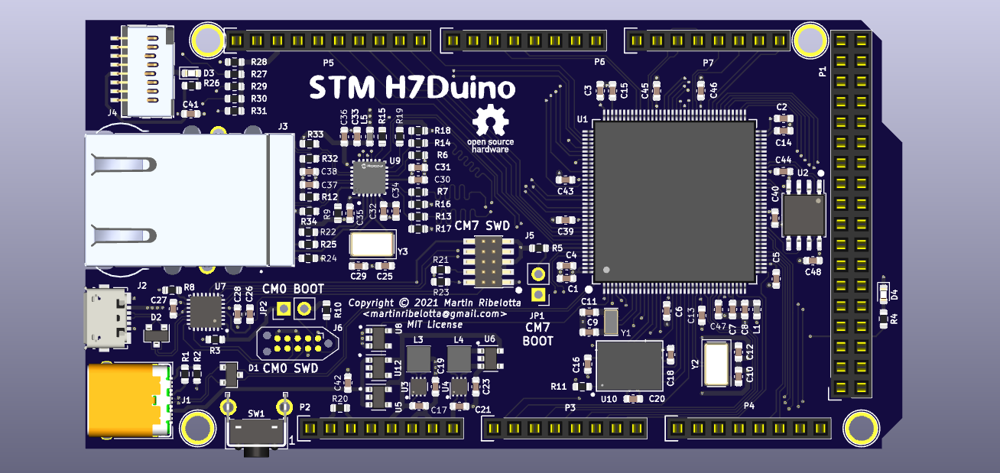
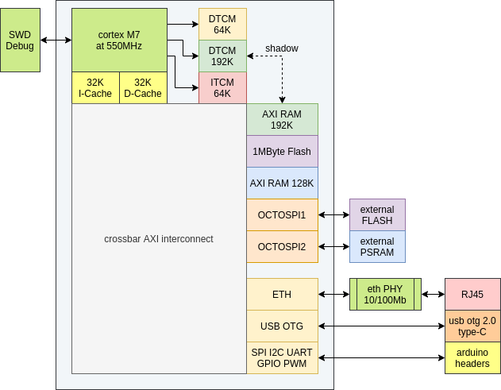
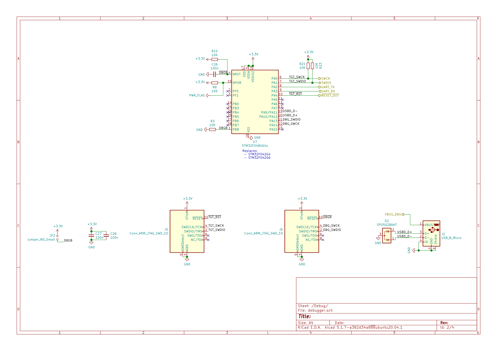

# H730 Duino

Arduino form factor and software compatible board with giant cortex-m7 at 550MHz.

## Characteristics

 - CPU Cortex-M7 at 550MHz
 - 1MB of internal flash
 - 500KB of internal RAM
 - 8MB of external QSPI PSRAM at 133MHz SDR
 - 16/32/128MB of external QSPI Flash at 133MHz SDR
 - 10/100Mb Ethernet
 - USB 2.0 OTG Type-C
 - USB CMSIS-DAP Debugger
 - uSD Card slot
 - Arduino Due/Mega compatible pin headers (3.3V IO, 5V tolerant on some pins)

## Schematics

[Download in PDF format](docs/schematic.pdf)

## Licence

[MIT Licence](LICENCE.txt)
