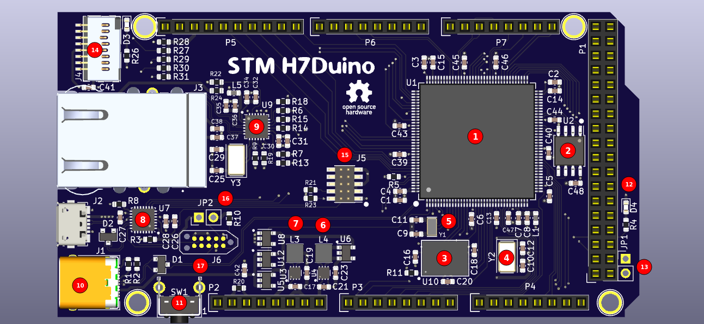
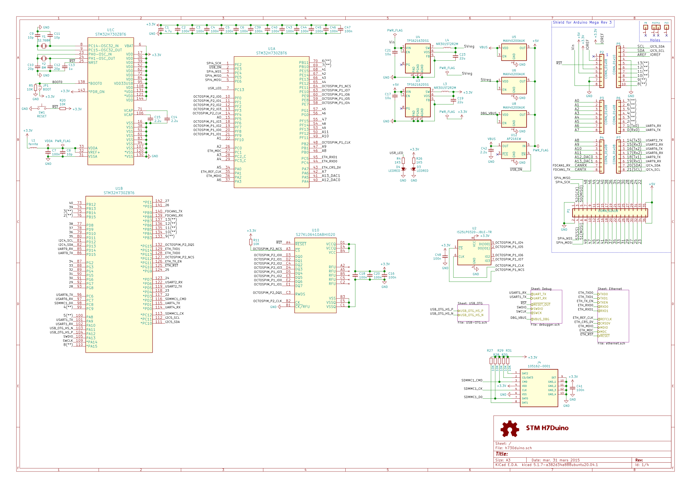

# H730/733 Duino

Arduino form factor and software compatible board with giant cortex-m7 at 550MHz.

See test firmware [here](https://github.com/martinribelotta/h730duino-firmware)

## Characteristics

- CPU Cortex-M7 at 550MHz.
- 128K/1 MB of internal flash (depending on the MCU version).
- 500 KB of internal RAM.
- 8 MB of external QSPI PSRAM at 133MHz SDR.
- 16/32/128 MB of external QSPI Flash at 133MHz SDR.
- 10/100Mb Ethernet.
- USB 2.0 OTG Type-C with power switch control.
- USB CMSIS-DAP Debugger.
- micro SD Card slot.
- Arduino Due/Mega compatible pin headers (3.3V IO, 5V tolerant on some pins).
- Arduino API compatible (via STM32Duino project).
- Micropython support.
- Protected power inputs with ideal diodes and DC-DC converter

## Capabilities and applications

Some interesting CPU capabilities are listed below:

- Hard real time capable CPU with predictable execution using tightly coupled memory for instruction and data.
- High speed and precision PWM suitable for motor control (BLDC, Stepper, DC).
- High resolution timing measure in capture mode for some pins.
- Arbitrary waveform generation in any GPIO using DMA without CPU intervention.
- High speed DACs suitable to generate analog signals up to 18MHz.
- Tow high speed 12 bits ADC suitable to capture up to 5MSPS in any channel.
- One high speed 16 bits ADC suitable to capture up to 7.5MSPSP
- Internal RAM with multiple block partitions enabling multiple peripheral access at same time without contention.
- External high density RAM up to 8 MB connected across 133MHz QSPI bus accessible in memory mapped mode or block device mode with on the fly encryption/decryption.
- External high density FLASH up to 16 MB connected across 133MHz QSPI bus accessible in memory mapped mode or block device mode with on the fly encryption/decryption.
- Multiplexed parallel memory controller for LCD and TFT access
- LCD interface with 666, 565 and 888 RGB with hsync/vsync and pixel clk (max 150MHz)
- Parallel capture port at 110MHz
- Parallel signal generation at 50MHz

These capabilities enable multiple interesting applications:

- High precision CNC and 3D printing.
- Signal generator and data acquisition system
- Human machine interface enabled terminal with USB, CAN and Ethernet support
- High speed logic analyzer.
- Programmable instrumentation system.
- Network laboratory instrument.

## Layout

 1. MCU STM32H730/733/732
 2. QSPI flash (4/8/16/32MiB)
 3. HyperRAM (8MiB)
 4. 8MHz crystal
 5. 32.768KHz RTC crystal
 6. 5V in regulator
 7. 3.3V main regulator
 8. CMSIS-DAP debugger
 9. Ethernet PHY
 10. USB OTG Full Speed (connected to MCU)
 11. Reset button
 12. User LED
 13. STM32H7 BOOT jumper
 14. MicroSD connector
 15. SWD MCU connector
 16. CMSIS-DAP boot jumper
 17. CMSIS-DAP pogo pins for programming

## Schematics

[Download in PDF format](docs/schematic.pdf)

[Octopart BoM](https://octopart.com/bom-tool/nudLZO8C)

[CSV BoM (octpart compatible)](docs/stm32h7duino-v01.csv)

## License

[MIT License](LICENCE.tx)
